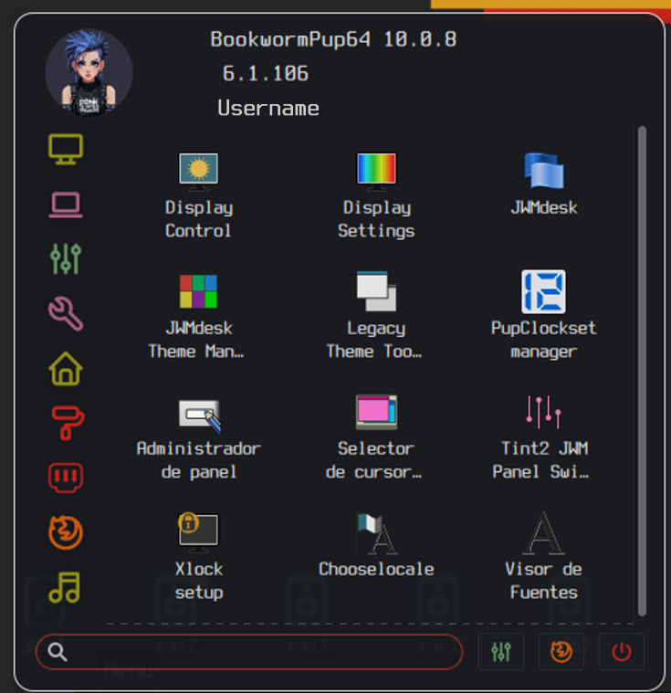
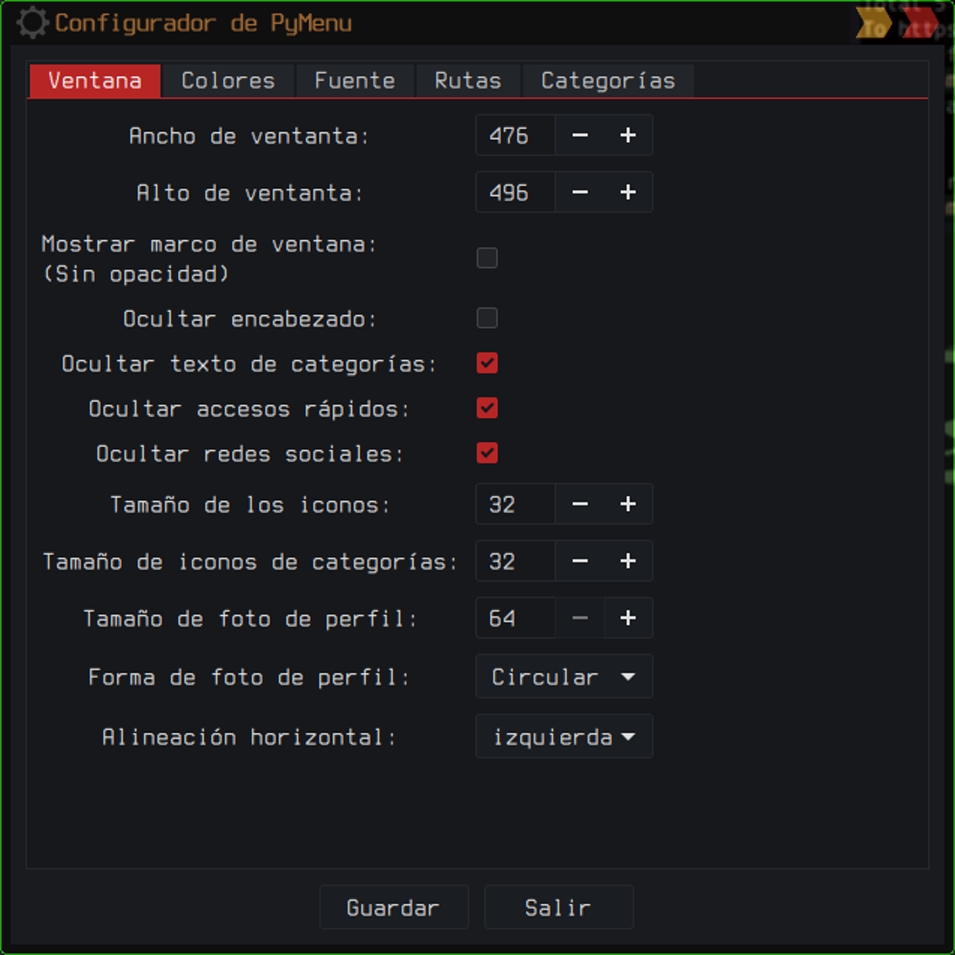

# PyMenuPup

Un menú de inicio moderno y personalizable para JWM (Joe's Window Manager) y Puppy Linux, escrito en Python con GTK3.


**[English](README.md) | Español**

---

## Descripción

PyMenuPup es un menú de inicio moderno y altamente personalizable diseñado específicamente para distribuciones ligeras como Puppy Linux que usan JWM como gestor de ventanas. También es compatible con Openbox y Tint2.

### Características Principales

- Totalmente personalizable: colores, fuentes, tamaños y posicionamiento
- Multilingüe: soporte para inglés y español
- Búsqueda rápida: encuentra aplicaciones al instante
- Acceso rápido: carpetas del sistema con un clic
- Integración web: búsqueda directa en el navegador
- Foto de perfil: personalizable (cuadrada o circular)
- Detección automática: soporte para JWM, Openbox y Tint2
- Rendimiento optimizado: carga perezosa de aplicaciones
- Categorías personalizables: oculta las que no necesites
- Navegación con teclado: soporte para teclas de flecha y Enter
- Integración con tema del sistema: usa los colores del tema GTK

---

## Componentes

### 1. pymenu-globicons.py
Menú principal que muestra todas las aplicaciones del sistema organizadas por categorías.

**Funcionalidades:**
- Lectura automática del archivo `.jwmrc` de JWM
- Categorización inteligente de aplicaciones
- Búsqueda en tiempo real
- Acceso rápido a carpetas comunes
- Integración con redes sociales
- Creación de accesos directos en el escritorio
- Soporte de teclado (navegación con teclas de flecha)
- Menú contextual (clic derecho en aplicaciones)

### 2. pymenu-config.py
Herramienta gráfica de configuración para personalizar el menú.

**Opciones configurables:**
- Dimensiones y posición de la ventana
- Colores y transparencia
- Fuentes y tamaños de texto
- Rutas de archivos y comandos
- Categorías visibles/ocultas
- Integración con tema GTK del sistema

---

## Variantes de Distribución

PyMenuPup tiene diferentes versiones optimizadas para distintos entornos Linux:

### Versión Original (Puppy Linux)
La versión principal (`pymenu-globicons.py` y `pymenu-config.py`) está diseñada específicamente para Puppy Linux, que:
- Ejecuta el sistema como usuario root por defecto
- No requiere el uso de `sudo` para operaciones del sistema
- Tiene rutas y configuraciones específicas de Puppy Linux

### Versiones para Distribuciones Linux Estándar

En la carpeta `distro-linux/` encontrarás versiones adaptadas para otras distribuciones Linux que usan usuarios no root:

#### **Essora** (`distro-linux/Essora/`)
Versión modificada para distribuciones Linux estándar (Debian, Ubuntu, Arch, Fedora, etc.) con los siguientes cambios:

- **Gestión de permisos**: Uso apropiado de `sudo` para operaciones que requieren privilegios elevados
- **Rutas adaptadas**: Configuraciones ajustadas para estructuras de directorios de usuario estándar
- **Comandos del sistema**: Adaptación de comandos de apagado, reinicio y bloqueo para sistemas multiusuario
- **Variables de entorno**: Manejo correcto de `$HOME` y `$USER` para usuarios no root

#### **Trixiepup64** (`distro-linux/Trixiepup64/`)
Versión especializada para Trixiepup64 (Wayland + compositor labwc) con las siguientes características:

- **Compatibilidad con Wayland**: Optimizado para el servidor de display Wayland en lugar de X11
- **Integración con labwc**: Soporte nativo para el compositor labwc (similar a Openbox para Wayland)
- **Parser de menú Openbox**: Lee y analiza `menu.xml` del formato Openbox/labwc
- **Comandos específicos de Wayland**: Comandos del sistema adaptados para el entorno Wayland
- **Estructura Menu.xml**: Compatible con la estructura de menú estándar de Openbox usada por el generador de menús de labwc

**¿Cuándo usar cada versión?**
- **Usa la versión principal** si estás en Puppy Linux o derivados
- **Usa la versión Essora** si estás en Debian, Ubuntu, Arch, Fedora, Mint u otras distribuciones estándar
- **Usa la versión Trixiepup64** si estás en Trixiepup64 o cualquier sistema basado en Wayland que use el compositor labwc

---

## Dependencias

### Requisitos del Sistema

```
Python 3 (>= 3.6)
python3-gi
gir1.2-gtk-3.0
gir1.2-gdk-3.0
gir1.2-gdkpixbuf-2.0
gir1.2-pango-1.0
gir1.2-gio-2.0
gir1.2-glib-2.0
xdg-utils
Nerd Fonts
```

### Instalación de Dependencias

#### En Puppy Linux:
```bash
# El Gestor de Paquetes de Puppy (PPM) usualmente incluye python3-gi
# Verifica que lo tengas instalado:
python3 --version
python3 -c "import gi; print('GTK3 OK')"
```

#### En Debian/Ubuntu:
```bash
sudo apt update
sudo apt install python3 python3-gi python3-gi-cairo gir1.2-gtk-3.0 xdg-utils
```

#### En Arch Linux:
```bash
sudo pacman -S python python-gobject gtk3 xdg-utils
```

#### En Fedora/RHEL:
```bash
sudo dnf install python3 python3-gobject gtk3 xdg-utils
```

---

## Instalación

### Instalación Manual

1. Clona el repositorio:
```bash
git clone https://github.com/tu-usuario/PyMenuPup.git
cd PyMenuPup
```

2. Copia los scripts al sistema:
```bash
sudo cp pymenu-globicons.py /usr/local/bin/
sudo cp pymenu-config.py /usr/local/bin/

# Da permisos de ejecución
sudo chmod +x /usr/local/bin/pymenu-globicons.py
sudo chmod +x /usr/local/bin/pymenu-config.py
```

3. Crea enlaces simbólicos (opcional):
```bash
sudo ln -s /usr/local/bin/pymenu-globicons.py /usr/local/bin/pymenu
sudo ln -s /usr/local/bin/pymenu-config.py /usr/local/bin/pymenu-config
```

---

## Configuración

### Primera Ejecución

Al ejecutar PyMenuPup por primera vez, se creará automáticamente un archivo de configuración en:

```
~/.config/pymenu.json
```

### Configurando JWM

Edita tu archivo `~/.jwmrc` y agrega:

```xml
<Program label="Menu" icon="applications-system">
    /usr/local/bin/pymenu-globicons.py
</Program>
```

O para usar con coordenadas específicas:

```xml
<Program label="Menu" icon="applications-system">
    /usr/local/bin/pymenu-globicons.py 100 100
</Program>
```

En PuppyLinux /root/.jwmrc:

```xml
<RootMenu label="Menu" labeled="false" height="24" onroot="3">
```
luego /root/.jwmrc-tray

```xml
 <TrayButton label="[MENU]" popup="Open menú">exec:pymenu-globicons.py</TrayButton>
```

### Configurando con Tint2

Si usas Tint2, edita `~/.config/tint2/tint2rc`:

```ini
# Lanzador
launcher_item_app = /usr/local/bin/pymenu-globicons.py
```

---

## Uso

### Ejecutando el Menú

```bash
# Ejecución básica
pymenu-globicons.py

# Con posición personalizada (x, y)
pymenu-globicons.py 100 100

# Con archivo JWM personalizado
pymenu-globicons.py /ruta/a/jwmrc
```

### Abriendo el Configurador

```bash
pymenu-config.py
```

O desde el menú principal, haz clic en el icono de configuración.

### Atajos de Teclado

- **Esc**: Cerrar el menú
- **Alt + Clic Izquierdo**: Mover la ventana
- **Clic Central (rueda)**: Cerrar el menú
- **Teclas de Flecha**: Navegar por las aplicaciones
- **Enter**: Lanzar aplicación seleccionada
- **Clic Derecho en app**: Menú contextual

---

## Estructura de Archivos

```
PyMenuPup/
├── pymenu-globicons.py      # Menú principal
├── pymenu-config.py          # Configurador GTK
├── README.md                 # Documentación en inglés
├── README-es.md              # Este archivo
├── TECHNICAL.md              # Documentación técnica (inglés)
├── TECHNICAL-es.md           # Documentación técnica (español)
├── LICENSE                   # Licencia GPL
└── screenshots/              # Capturas de pantalla (opcional)
```

### Archivos de Configuración del Usuario

```
~/.config/
├── pymenu.json              # Configuración principal
└── tint2/
    └── tint2rc              # Config de Tint2 (si aplica)

~/
├── .jwmrc                   # Config de JWM
├── .jwmrc-tray             # Config de bandeja JWM
└── .face                    # Foto de perfil
```

---

## Personalización Avanzada

### Editando la Configuración Manualmente

El archivo `~/.config/pymenu.json` tiene esta estructura:

```json
{
    "window": {
        "width": 700,
        "height": 850,
        "decorated_window": false,
        "hide_header": false,
        "hide_quick_access": false,
        "hide_social_networks": false,
        "hide_category_text": false,
        "halign": "center",
        "icon_size": 32,
        "category_icon_size": 16,
        "profile_pic_size": 128,
        "profile_pic_shape": "square"
    },
    "font": {
        "family": "Sans 12",
        "size_categories": 12000,
        "size_names": 10000,
        "size_header": 8000
    },
    "colors": {
        "use_gtk_theme": false,
        "background": "rgba(0, 0, 0, 0.7)",
        "border": "rgba(255, 255, 255, 0.1)",
        "text_normal": "#D8DEE9",
        "text_header_os": "#D8DEE9",
        "text_header_kernel": "#D0883A",
        "text_header_hostname": "#88C0D0",
        "hover_background": "rgba(255, 255, 255, 0.1)",
        "button_normal_background": "rgba(0,0,0,0.6)",
        "button_text": "#ECEFF4",
        "categories_background": "rgba(0,0,0,0.6)"
    },
    "paths": {
        "profile_pic": "/root/.face",
        "profile_manager": "/usr/local/bin/ProfileManager.py",
        "shutdown_cmd": "/usr/local/bin/apagado-avatar.py",
        "jwmrc_tray": "/root/.jwmrc-tray",
        "tint2rc": "/root/.config/tint2/tint2rc"
    },
    "tray": {
        "use_tint2": false
    },
    "categories": {
        "excluded": []
    }
}
```

### Agregando Iconos Personalizados

PyMenuPup busca iconos en estas rutas:
- `/usr/local/lib/X11/pixmaps`
- `/usr/share/pixmaps`
- `/usr/share/icons/hicolor/*/apps`
- `/usr/share/pixmaps/puppy`

Coloca tus iconos en cualquiera de estas carpetas.

### Excluyendo Categorías

Edita el archivo de configuración para ocultar categorías específicas:

```json
"categories": {
    "excluded": ["Ayuda", "Salir", "Rectificar"]
}
```

---

## Solución de Problemas

### El menú no aparece

```bash
# Verifica que Python3 esté instalado
python3 --version

# Verifica las dependencias de GTK
python3 -c "import gi; gi.require_version('Gtk', '3.0'); from gi.repository import Gtk; print('GTK OK')"
```

### Los iconos no se muestran

```bash
# Verifica las rutas de iconos en tu .jwmrc
grep IconPath ~/.jwmrc

# Reinstala el paquete de iconos
# (en Puppy Linux usualmente viene incluido)
```

### Errores de permisos

```bash
# Asegúrate de que los scripts sean ejecutables
chmod +x /usr/local/bin/pymenu-globicons.py
chmod +x /usr/local/bin/pymenu-config.py
```

### El menú se cierra inmediatamente

```bash
# Ejecuta desde la terminal para ver los errores
python3 /usr/local/bin/pymenu-globicons.py
```

### La foto de perfil no carga

```bash
# Verifica que la foto de perfil exista
ls -la ~/.face

# O verifica la ruta configurada
grep profile_pic ~/.config/pymenu.json
```

---

## Contribuir

¡Las contribuciones son bienvenidas! Si quieres mejorar PyMenuPup:

1. Haz un fork del repositorio
2. Crea una rama para tu característica (`git checkout -b feature/CaracteristicaAsombrosa`)
3. Haz commit de tus cambios (`git commit -m 'Agrega alguna CaracteristicaAsombrosa'`)
4. Haz push a la rama (`git push origin feature/CaracteristicaAsombrosa`)
5. Abre un Pull Request

---

## Licencia

Este proyecto está licenciado bajo la Licencia GPL v3. Consulta el archivo `LICENSE` para más detalles.

---

## Autor

Nilson Morales
- GitHub: [@woofshahenzup](https://github.com/Woofshahenzup)
- Foro: [Foro de Puppy Linux](https://forum.puppylinux.com)

---

## Agradecimientos

- Al equipo de Puppy Linux por crear una distribución tan ligera y eficiente
- A Joe Wingbermuehle por JWM (Joe's Window Manager)
- A las comunidades de GTK y Python
- A todos los contribuidores del proyecto

---

## Capturas de Pantalla y Demo

### Capturas de Pantalla



### Video Demo
[](https://www.youtube.com/watch?v=CV71anlLqe8)
*Haz clic para ver el demo completo en YouTube*

---

## Enlaces Útiles

- [Puppy Linux Oficial](https://puppylinux.com)
- [Documentación de JWM](http://joewing.net/projects/jwm/)
- [Documentación de GTK3](https://docs.gtk.org/gtk3/)
- [Documentación de Python GObject](https://pygobject.readthedocs.io/)

---

**¿Te gusta PyMenuPup? ¡Dale una estrella al repositorio!**
